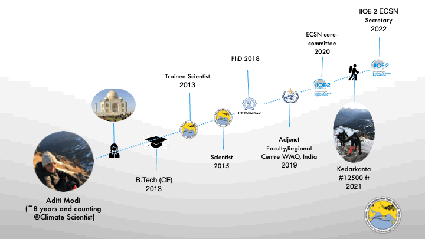

### Aditi Modi

**Aditi Modi** (she/her/hers) is a Climate Scientist at the *Centre for Climate Change Research, Indian Institute of Tropical Meteorology, Pune, India*. I focus on understanding the biophysical interactions in the tropical oceans, particularly the Indian Ocean, particularly under the current climate change scenario. I am also pursuing my Ph.D in Climate Sciences at IIT Bombay, India . 

Besides research, I am an adjunct faculty for the course **Advanced Physical Oceanography and Ocean-Atmosphere Interactions** offered to various batches of Meteorological trainees at the *Meteorological Training Institute, Indian Regional Centre, World Meteorological Organization (WMO)*. 

extra:
Aditi is an avid reader and her current interests include science communication, investing and writing.
and has completed her B.Tech from A.P.J. Abdul Kalam University, Lucknow in India

I earned my Ph.D in Political Science from the University of North Carolina at Chapel Hill and my B.A. in Political Science from Haverford College. My academic work has been published or is forthcoming in International Studies Quarterly, Conflict Management and Peace Science, Political Science Research and Methods, and PS: Political Science & Politics, among other outlets. This research explores the causes and consequences of political violence using a broad variety of methods such as latent variable models, geospatial analysis, and big data. While primarily focused on civil conflict, it also examines contentious political phenomena including terrorism and economic statecraft, and develops new measures of institutions in international relations. I have teaching experience in both quantitative methodology and international relations, and am a certified instructor with The Carpentries.

